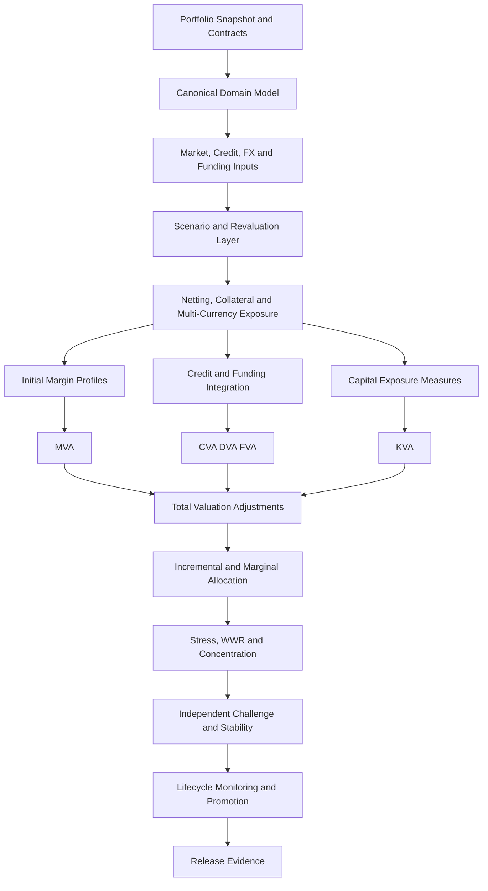
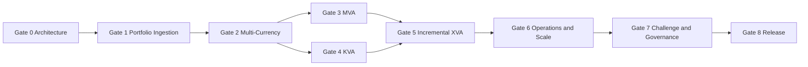

# Quant Model Risk Lab v1.4  
## Gate 0 Architecture and Execution Blueprint

**Document status:** Approved architecture baseline  
**Release line:** v1.4  
**Predecessor:** v1.3.0  
**v1.3 assurance status:** PASS  
**v1.4 readiness:** READY_FOR_SCOPING  
**Production approval:** False  
**Primary purpose:** Define the architecture, scope, controls, implementation order, evidence requirements, and promotion gates for the next major Quant Model Risk Lab release.

---

## 1. Executive decision

Quant Model Risk Lab v1.4 will extend the validated v1.3 XVA platform into an institutional portfolio, margin, capital, incremental-allocation, and operational-recalculation framework.

The release will not replace the v1.3 architecture. It will build on the existing scenario, valuation, collateral, exposure, credit, CVA/DVA/FVA, wrong-way-risk, stress, independent-challenge, lifecycle-monitoring, and promotion-governance layers.

The strategic transition is:

\[
\text{v1.3: validated XVA engine}
\quad\longrightarrow\quad
\text{v1.4: institutional portfolio and capital-adjustment platform}
\]

The strongest value proposition is not the addition of isolated formulas. It is the construction of a governed system in which portfolio ingestion, multi-currency collateral, initial margin, capital consumption, incremental XVA, operational recalculation, and release evidence remain traceable to controlled assumptions and independently testable components.

---

## 2. v1.4 release mandate

v1.4 must establish five new institutional capabilities:

1. **Portfolio-scale ingestion and canonical representation**  
   Accept controlled trade, counterparty, agreement, collateral, curve, and scenario inputs through explicit schemas and deterministic validation.

2. **Multi-currency exposure and collateral treatment**  
   Represent trade currency, collateral currency, settlement currency, FX conversion, collateral remuneration, and cross-currency funding consistently.

3. **Margin Valuation Adjustment**  
   Produce transparent initial-margin profiles and MVA under governed funding, discounting, closeout, and simulation assumptions.

4. **Capital Valuation Adjustment**  
   Produce KVA using transparent capital definitions, hurdle rates, time integration, component attribution, and documented non-regulatory boundaries.

5. **Incremental, marginal, and allocation analytics**  
   Measure trade and portfolio contribution to XVA, MVA, KVA, concentration, and stress using controlled full-revaluation and approximation methods.

These capabilities must be supported by operational recalculation, performance evidence, independent challengers, lifecycle controls, and release governance.

---

## 3. Release principles

### 3.1 Preserve v1.3 evidence

The v1.3.0 tag, release artifacts, contracts, tests, dashboards, and assurance evidence are immutable historical records.

v1.4 must not alter the meaning of v1.3 results. Shared modules may evolve only through backward-compatible interfaces or explicitly versioned contracts.

### 3.2 Evidence before promotion

Every major calculation layer must provide:

- machine-readable configuration
- deterministic benchmark cases
- invariant tests
- reconciliation evidence
- sensitivity evidence
- model-boundary documentation
- explicit promotion status
- reproducibility metadata

### 3.3 Transparent institutional approximations

Where a production institution would use proprietary pricing libraries, legal agreement data, regulatory capital systems, or historical margin data, v1.4 must:

- state the approximation
- expose the parameter
- preserve traceability
- provide a challenger
- prevent claims of production or regulatory approval

### 3.4 No hidden aggregation

Portfolio, counterparty, netting-set, collateral-set, currency, product, desk, and trade results must remain separately attributable.

### 3.5 Controlled complexity

New quantitative capabilities must be introduced in dependency order. No gate may rely on an unvalidated downstream assumption.

---

## 4. Scope

## 4.1 In scope

### Portfolio and data architecture

- canonical trade model
- counterparty hierarchy
- netting-set and collateral-set representation
- agreement and CSA-like terms
- product-family classification
- trade, collateral, settlement, and reporting currencies
- portfolio snapshots and effective dates
- schema versioning
- deterministic validation
- data-quality evidence
- lineage and content hashes

### Multi-currency XVA

- FX conversion paths
- collateral-currency selection
- collateral remuneration
- cross-currency discounting
- funding spread by currency
- settlement-currency conversion
- FX-driven exposure and wrong-way-risk channels
- currency-level attribution
- controlled currency triangulation

### Initial margin and MVA

- historical-simulation-style margin proxy
- parametric or sensitivity-based margin proxy
- configurable margin period of risk
- initial-margin profile
- posting and receiving treatment
- segregated-margin funding treatment
- MVA integration
- margin model sensitivity
- independent MVA challenger
- margin concentration diagnostics

### Capital and KVA

- exposure-at-default proxy
- capital profile
- counterparty credit-risk capital proxy
- stressed capital multiplier
- hurdle-rate term structure
- capital release over time
- KVA integration
- component and counterparty attribution
- capital sensitivity and concentration
- independent KVA challenger

### Incremental and marginal analytics

- full-revaluation incremental XVA
- marginal XVA approximation
- Euler-style allocation where valid
- leave-one-out contribution
- trade insertion and removal analysis
- portfolio concentration effects
- non-additivity diagnostics
- attribution reconciliation
- ranking of dominant value and risk contributors

### Operational controls

- change-impact analysis
- snapshot comparison
- partial recalculation eligibility
- dependency graph
- deterministic cache keys
- stale-input detection
- model-version lineage
- recalculation manifest
- performance and memory evidence
- failure recovery
- release-candidate evidence

## 4.2 Explicitly out of scope for v1.4

The following areas remain outside the public release boundary unless separately approved:

- production trade capture
- live market-data ingestion
- proprietary pricing engines
- legally enforceable CSA interpretation
- regulatory reporting
- binding SA-CCR, IMM, FRTB, or Basel capital approval
- production initial-margin approval
- SIMM certification
- CCP margin replication
- legal closeout opinions
- production collateral optimization
- real-time intraday deployment
- production cloud authorization
- confidential counterparty data
- public claims of regulatory compliance

These boundaries do not reduce the analytical value of the platform. They define where transparent public methodology ends and institution-specific implementation begins.

---

## 5. Target architecture



The architecture is divided into eight controlled layers.

### Layer 1 — Canonical portfolio domain

Defines the authoritative representation of:

- portfolio
- legal entity
- counterparty
- netting set
- collateral set
- trade
- product family
- cash flow
- currency
- agreement terms
- valuation date
- snapshot version

### Layer 2 — Input and market state

Defines:

- curves
- credit spreads
- FX spot and paths
- volatility assumptions
- funding curves
- collateral remuneration
- capital parameters
- scenario identifiers
- data freshness
- provenance

### Layer 3 — Revaluation and exposure

Extends the v1.3 exposure engine to:

- consume canonical portfolio inputs
- preserve trade-to-netting-set mapping
- support multiple currencies
- produce pathwise converted values
- identify currency and collateral effects
- preserve exposure lineage

### Layer 4 — Margin

Produces initial-margin profiles under approved proxy methods and integrates MVA using controlled funding and discount assumptions.

### Layer 5 — Capital

Produces capital profiles and KVA using transparent public approximations, hurdle-rate terms, and capital-release logic.

### Layer 6 — Incremental analytics

Measures portfolio change through insertion, removal, replacement, and approximation-based contribution methods.

### Layer 7 — Operational recalculation

Determines which outputs must be rebuilt after a change in:

- trade population
- market data
- credit data
- collateral terms
- margin assumptions
- capital assumptions
- model version
- configuration

### Layer 8 — Validation and promotion

Extends the v1.3 challenger, stability, monitoring, GenAI, and governance framework to all v1.4 components.

---

## 6. Canonical domain model

The following entities must be versioned and immutable within a calculation run.

| Entity | Required role |
|---|---|
| `PortfolioSnapshot` | Calculation boundary, valuation date, reporting currency, content hash |
| `LegalEntity` | Owning or booking entity |
| `Counterparty` | Credit-risk entity and hierarchy |
| `NettingSet` | Closeout and exposure aggregation boundary |
| `CollateralSet` | Collateral agreement and eligible currency boundary |
| `TradeRecord` | Canonical trade identity, product type, currency, maturity, notional, mapping |
| `AgreementTerms` | Threshold, MTA, margin frequency, MPOR, collateral rules |
| `CurrencyDefinition` | Currency code, discounting, funding, collateral-remuneration references |
| `MarketState` | Curves, FX, volatilities, scenario provenance |
| `CreditState` | Counterparty and own-credit curves |
| `CapitalPolicy` | Capital method, multipliers, hurdle rate, release rule |
| `MarginPolicy` | Margin proxy, horizon, confidence level, funding treatment |
| `CalculationRun` | Model version, configuration hash, input hash, timestamp, seed |
| `EvidenceManifest` | Artifact inventory, hashes, statuses, CI and approval evidence |

No calculation result may exist without a `CalculationRun` identity and a complete input lineage.

---

## 7. Quantitative specification

## 7.1 Multi-currency exposure

For trade \(i\), path \(p\), and time \(t\), reporting-currency value is:

\[
V^{R}_{i,p,t}
=
V^{C_i}_{i,p,t}
\times
FX_{C_i \rightarrow R,p,t}
\]

Netting-set exposure must be calculated after currency conversion and agreement-level aggregation, not by independently summing precomputed standalone exposures.

Collateral in currency \(K\) is converted using:

\[
C^R_{p,t}
=
C^K_{p,t}
\times
FX_{K \rightarrow R,p,t}
\]

The implementation must separately attribute:

- trade-value effect
- FX-conversion effect
- collateral-currency effect
- funding-currency effect
- cross-currency stress effect

## 7.2 Initial-margin profile

The public platform may support two approved proxy families:

### Historical-simulation-style proxy

\[
IM_t
=
Q_{\alpha}
\left(
-\Delta V_{t,t+\delta}
\right)
+
A_t
\]

where:

- \(\alpha\) is the governed confidence level
- \(\delta\) is the margin period of risk
- \(A_t\) is a governed add-on

### Parametric proxy

\[
IM_t
=
z_{\alpha}
\sqrt{
\mathbf{s}_t^\top
\Sigma_t
\mathbf{s}_t
}
+
A_t
\]

where \(\mathbf{s}_t\) is a sensitivity vector and \(\Sigma_t\) is a governed risk-factor covariance matrix.

Neither proxy may be represented as certified SIMM or CCP margin.

## 7.3 Margin Valuation Adjustment

For posted initial margin \(IM^P_t\):

\[
MVA
=
\int_0^T
DF(0,t)
\,
S(0,t)
\,
s^{IM}_F(t)
\,
IM^P_t
\,dt
\]

The implementation must state whether:

- received margin is reusable
- posted margin is segregated
- own and counterparty survival are applied
- closeout occurs at first default
- margin is returned at default
- funding spread is deterministic or scenario-dependent

## 7.4 Capital profile

The default public capital proxy is:

\[
K_t
=
m_t
\cdot
EAD_t
\cdot
RW_t
\cdot
c_t
\]

where:

- \(EAD_t\) is an approved exposure-at-default proxy
- \(RW_t\) is a transparent risk weight or capital factor
- \(m_t\) is a stress or maturity multiplier
- \(c_t\) is a capital ratio or conversion factor

All parameters must be visible and configurable.

## 7.5 Capital Valuation Adjustment

\[
KVA
=
\int_0^T
DF(0,t)
\,
S(0,t)
\,
h(t)
\,
K_t
\,dt
\]

where \(h(t)\) is the hurdle-rate term structure.

The platform must distinguish:

- regulatory-capital proxy
- economic-capital proxy
- stressed capital
- capital benefit or release
- modelled KVA
- institution-specific KVA not represented publicly

## 7.6 Incremental XVA

For portfolio \(P\) and new trade \(j\):

\[
\Delta XVA_j
=
XVA(P \cup \{j\})
-
XVA(P)
\]

For removal:

\[
\Delta XVA_j^{remove}
=
XVA(P)
-
XVA(P \setminus \{j\})
\]

The engine must separately report changes in:

- CVA
- DVA
- FCA
- FBA
- FVA
- MVA
- KVA
- WWR uplift
- stress loss
- total valuation adjustment

## 7.7 Marginal and allocated XVA

Where differentiability and positive homogeneity are supportable:

\[
mXVA_i
=
\frac{\partial XVA}{\partial w_i}
\]

and an Euler-style allocation may be computed as:

\[
aXVA_i
=
w_i
\frac{\partial XVA}{\partial w_i}
\]

The implementation must detect when Euler allocation is invalid because of:

- thresholds
- MTA
- collateral discontinuities
- non-smooth margin rules
- discrete trade attributes
- concentration add-ons
- stressed regime switches

---

## 8. Gated implementation sequence

## Gate 0 — Architecture, scope, and contract freeze

### Objective

Create the authoritative v1.4 architecture, scope, dependency map, release boundaries, and implementation contracts before quantitative coding begins.

### Required artifacts

- `docs/v1_4_architecture_and_execution_blueprint.md`
- `configs/v1_4_scope_contract.yml`
- `configs/v1_4_architecture_contract.yml`
- `configs/v1_4_gate_sequence.yml`
- `configs/release_manifest_v1_4_gate0.json`
- `tests/test_v1_4_gate0_contracts.py`

### Promotion conditions

- v1.3.0 remains unchanged
- scope and exclusions are machine-readable
- dependency order is explicit
- every future gate has acceptance criteria
- production and regulatory boundaries are explicit
- all repository tests pass
- branch protection and CI pass
- human approval is recorded

### Gate 0 status target

`ARCHITECTURE_FROZEN`

---

## Gate 1 — Canonical portfolio ingestion and lineage

### Objective

Create the governed portfolio data model and deterministic ingestion pipeline.

### Required capabilities

- portfolio snapshot schema
- trade schema
- counterparty hierarchy
- netting and collateral mapping
- currency and date validation
- duplicate-trade detection
- referential-integrity checks
- lineage and content hashing
- error classification
- synthetic reference portfolios

### Evidence

- schema contracts
- valid and invalid fixtures
- round-trip serialization tests
- deterministic hashes
- ingestion benchmarks
- data-quality report
- independent parser challenger

### Promotion condition

No downstream calculation may start from unvalidated or partially mapped portfolio data.

---

## Gate 2 — Multi-currency exposure and collateral

### Objective

Extend exposure, collateral, discounting, and funding logic to multiple currencies.

### Required capabilities

- currency-aware values
- FX path conversion
- collateral currency
- collateral remuneration
- currency-specific discount curves
- currency-specific funding curves
- cross-currency exposure attribution
- triangulation controls
- FX stress and WWR linkage

### Evidence

- parity and triangulation benchmarks
- zero-FX-volatility benchmark
- single-currency backward-compatibility benchmark
- collateral-currency switch benchmark
- independent conversion challenger
- currency-attribution reconciliation

### Promotion condition

Single-currency v1.3 results must remain reproducible within governed tolerance.

---

## Gate 3 — Initial margin and MVA

### Objective

Introduce governed margin proxies and MVA.

### Required capabilities

- historical-simulation-style margin
- parametric margin
- MPOR
- confidence-level control
- margin add-ons
- posting and receiving profiles
- segregated funding
- MVA integration
- margin sensitivities
- margin concentration diagnostics

### Evidence

- zero-margin benchmark
- deterministic-loss benchmark
- confidence-level monotonicity
- MPOR monotonicity
- funding-spread monotonicity
- independent MVA challenger
- model-boundary disclosure

### Promotion condition

MVA must remain separately attributable and must not be silently embedded in FVA.

---

## Gate 4 — Capital profiles and KVA

### Objective

Introduce transparent capital proxies and KVA.

### Required capabilities

- EAD proxy
- risk-weight or capital-factor policy
- maturity and stress multipliers
- hurdle-rate term structure
- capital-release profile
- KVA integration
- counterparty, netting-set, and trade attribution
- capital concentration
- stressed KVA

### Evidence

- zero-capital benchmark
- zero-hurdle-rate benchmark
- capital monotonicity
- maturity-profile benchmark
- independent KVA challenger
- regulatory-boundary declaration

### Promotion condition

The release must never imply regulatory approval or certified capital adequacy.

---

## Gate 5 — Incremental, marginal, and allocation analytics

### Objective

Measure the contribution of trades and portfolio changes to total valuation adjustment and capital use.

### Required capabilities

- insertion and removal
- full-revaluation increment
- marginal approximation
- Euler-style allocation where valid
- approximation error
- non-additivity diagnostics
- portfolio ranking
- trade-level attribution
- concentration impact
- scenario-specific incremental results

### Evidence

- additive synthetic portfolio benchmark
- non-additive collateral benchmark
- finite-difference convergence
- leave-one-out reconciliation
- allocation residual
- full versus approximate comparison

### Promotion condition

Approximate marginal results must never replace full-revaluation evidence without explicit status and error disclosure.

---

## Gate 6 — Operational recalculation, performance, and scale

### Objective

Make the v1.4 architecture operationally credible for large synthetic portfolios.

### Required capabilities

- dependency graph
- partial recalculation rules
- deterministic cache keys
- stale-output detection
- restartable runs
- memory controls
- chunked portfolio processing
- reproducible parallel execution
- benchmark portfolios
- performance budgets
- failure evidence

### Evidence

- trade-count scaling curves
- path-count scaling curves
- memory peak evidence
- deterministic parallel results
- cache invalidation tests
- interrupted-run recovery
- full versus partial recalculation reconciliation

### Promotion condition

Performance improvements must not change quantitative results beyond governed tolerances.

---

## Gate 7 — Independent challenge, stability, and lifecycle governance

### Objective

Extend the v1.3 validation framework to all v1.4 modules.

### Required capabilities

- independent multi-currency challenger
- independent MVA challenger
- independent KVA challenger
- incremental-XVA challenger
- stability diagnostics
- benchmark drift
- model-version comparison
- data freshness
- promotion statuses
- monitoring thresholds
- GenAI challenge over approved evidence only

### Evidence

- component reconciliation
- sensitivity ranking
- seed and path stability
- time-grid refinement
- input perturbation
- challenger disagreement
- benchmark drift
- lifecycle monitoring dashboard

### Promotion condition

No material component may remain `BLOCK`; every `REMEDIATE` item must have documented disposition.

---

## Gate 8 — v1.4 release consolidation

### Objective

Consolidate v1.4 documentation, evidence, dashboards, release contracts, and publication controls.

### Required capabilities

- institutional README
- v1.4 validation dashboard
- final lifecycle report
- release manifest
- validation matrix
- human review
- governed GenAI challenge
- release notes
- citation metadata
- historical v1.3 preservation
- post-release assurance package

### Promotion sequence

1. local full-suite validation
2. pull-request CI
3. explicit `SQUASH`
4. post-merge `main` CI
5. release-candidate assurance
6. explicit `RELEASE`
7. annotated `v1.4.0` tag
8. GitHub release publication
9. post-release assurance
10. release-line freeze

---

## 9. Dependency map



No gate should be merged out of dependency order.

---

## 10. Repository architecture

The recommended additions are:

```text
src/qmrl/
  portfolio/
    domain.py
    schemas.py
    ingestion.py
    validation.py
    lineage.py
  multicurrency/
    fx_paths.py
    conversion.py
    collateral_currency.py
    funding_currency.py
  margin/
    initial_margin.py
    margin_models.py
    mva.py
    mva_challenger.py
  capital/
    capital_profile.py
    kva.py
    kva_challenger.py
  allocation/
    incremental.py
    marginal.py
    euler.py
    reconciliation.py
  operations/
    dependency_graph.py
    recalculation.py
    cache.py
    performance.py
  monitoring/
    v1_4_dashboard.py
    v1_4_lifecycle.py
```

Existing `src/qmrl/xva/` modules remain authoritative for v1.3-compatible XVA calculations. New interfaces should import or compose them rather than duplicate validated logic.

---

## 11. Configuration contracts

Every gate must introduce machine-readable contracts. The minimum contract families are:

- portfolio schema contract
- currency contract
- collateral-currency contract
- margin-policy contract
- MVA integration contract
- capital-policy contract
- KVA integration contract
- incremental-XVA contract
- allocation contract
- recalculation contract
- performance-budget contract
- promotion contract
- release manifest

Each contract must contain:

- schema version
- owner
- status
- assumptions
- permitted modes
- prohibited modes
- numerical tolerances
- required evidence
- model boundaries
- backward-compatibility requirements

---

## 12. Testing strategy

## 12.1 Test layers

### Unit tests

Test formulas, schema rules, interpolation, conversion, integration, and classifications.

### Invariant tests

Examples:

- zero exposure implies zero CVA and KVA exposure component
- zero funding spread implies zero MVA funding charge
- zero hurdle rate implies zero KVA
- identical currencies reduce to the single-currency result
- adding an independent zero-value trade does not change portfolio XVA
- full allocation plus residual reconciles to portfolio value

### Contract tests

Validate machine-readable scope and prevent silent architectural changes.

### Benchmark tests

Use locked synthetic cases with deterministic expected outputs.

### Challenger tests

Reconcile production-style vectorized implementations with independent loop or alternative-formula implementations.

### Stability tests

Cover:

- seeds
- paths
- time grids
- FX volatility
- margin confidence levels
- MPOR
- funding spreads
- hurdle rates
- risk weights
- portfolio size

### Release tests

Enforce release identity, test counts, evidence hashes, documentation, historical preservation, and non-production boundaries.

## 12.2 Test-count policy

The v1.4 test surface must grow only through meaningful evidence. Test count is a governance metric, not a quality substitute.

Each gate must record:

- prior test count
- new tests
- total collected tests
- targeted test subset
- complete-suite result
- CI run identifiers
- release-manifest hash

---

## 13. Performance and scale objectives

Performance targets must be established in Gate 6 using controlled synthetic portfolios.

Initial target classes:

| Class | Trades | Netting sets | Currencies | Paths | Purpose |
|---|---:|---:|---:|---:|---|
| S | 100 | 5 | 2 | 1,000 | Unit and integration |
| M | 1,000 | 25 | 4 | 5,000 | Standard benchmark |
| L | 10,000 | 100 | 6 | 10,000 | Scale evidence |
| XL | 50,000 | 250 | 8 | governed | Stress benchmark |

No hard runtime promise should be published before measurement. Gate 6 must convert these classes into evidence-based budgets.

---

## 14. Model-risk governance

Every v1.4 component must report:

- purpose
- owner
- implementation version
- input version
- calibration date
- model status
- challenger status
- sensitivity status
- stability status
- data-quality status
- open boundaries
- promotion decision

Permitted statuses remain:

- `PASS`
- `PASS_WITH_MONITORING`
- `REMEDIATE`
- `BLOCK`

Portfolio promotion cannot pass when any material component is `BLOCK`.

A component marked `PASS_WITH_MONITORING` must include:

- reason
- measurable trigger
- monitoring frequency
- owner
- escalation condition

---

## 15. Governed GenAI role

GenAI may support evidence review but may not generate authoritative quantitative outputs.

Permitted uses:

- summarize approved evidence
- detect inconsistencies across approved artifacts
- identify missing citations
- classify documented findings
- generate a review checklist
- compare declared and observed boundaries

Required controls:

- approved evidence whitelist
- content hashes
- fixed prompt version
- structured output schema
- repository citations
- deterministic run manifest where possible
- mandatory human review
- no secret or proprietary input
- no autonomous promotion
- no autonomous release

---

## 16. Gate 0 implementation package

The next implementation artifact should create a documentation-and-contract branch:

```text
feature/v1-4-architecture-gate-0
```

Recommended commit:

```text
Define v1.4 architecture and execution Gate 0
```

Recommended pull-request title:

```text
Define v1.4 architecture, scope, and gated execution plan
```

Gate 0 should add only architecture, contracts, release-manifest evidence, and contract tests. It should not add MVA, KVA, multi-currency, or ingestion calculation code.

---

## 17. Gate 0 acceptance matrix

| Control | Required result |
|---|---|
| v1.3 tag unchanged | PASS |
| v1.3 release unchanged | PASS |
| Clean `main` before branch | PASS |
| Architecture blueprint present | PASS |
| Scope contract valid | PASS |
| Exclusions explicit | PASS |
| Gate dependency order valid | PASS |
| Future gate acceptance criteria complete | PASS |
| Production approval false | PASS |
| Regulatory approval false | PASS |
| Full repository suite | PASS |
| Required Python 3.12 CI | PASS |
| Human approval | PASS |
| Gate 0 status | `ARCHITECTURE_FROZEN` |

---

## 18. Success criteria for v1.4

v1.4 succeeds when the repository can demonstrate, with transparent evidence, that it can:

1. ingest and validate a portfolio snapshot;
2. map trades to counterparties, netting sets, collateral sets, and currencies;
3. calculate multi-currency exposure consistently;
4. estimate initial margin under governed public proxies;
5. calculate MVA separately from FVA;
6. estimate capital profiles under transparent public assumptions;
7. calculate KVA without implying regulatory certification;
8. calculate incremental and marginal XVA;
9. attribute total valuation adjustment to portfolio dimensions;
10. recalculate affected outputs after controlled changes;
11. scale to large synthetic portfolios with measured evidence;
12. reconcile independent challengers;
13. monitor lifecycle stability and benchmark drift;
14. publish a complete, reproducible, non-production release.

---

## 19. Final architectural decision

The approved v1.4 sequence is:

\[
\boxed{
\text{Architecture}
\rightarrow
\text{Portfolio ingestion}
\rightarrow
\text{Multi-currency}
\rightarrow
\text{MVA}
\rightarrow
\text{KVA}
\rightarrow
\text{Incremental analytics}
\rightarrow
\text{Operations and scale}
\rightarrow
\text{Independent governance}
\rightarrow
\text{Release}
}
\]

This order maximizes technical coherence, validation strength, publication value, and institutional relevance.

Gate 0 must now convert this blueprint into repository-controlled contracts and tests without modifying the frozen v1.3.0 release evidence.
