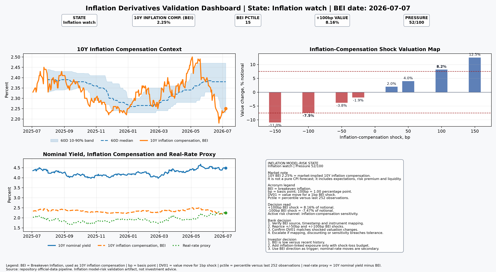

# Inflation Derivatives Validation Report

## Decision state: Inflation watch

**Inflation date:** 2026-07-07  
**Curve date:** 2026-07-06  
**Decision flags:** +100bp inflation shock value above 7.5 percent of notional  
**Inflation pressure score:** 52.2 / 100

## Acronym legend

| Term | Meaning |
|---|---|
| BEI | Breakeven Inflation, used here as 10Y market inflation compensation |
| bp | Basis point. 100bp equals 1.00 percentage point |
| DV01 | Value move for a 1bp shock in the relevant risk input |
| Inflation DV01 | Value move for a 1bp BEI shock |
| Pctile | Percentile versus the last 252 observations |
| Real-rate proxy | 10Y nominal Treasury yield minus 10Y breakeven inflation |

## Core metrics

| Metric | Value |
|---|---:|
| Fixed inflation rate | 2.250% |
| Market breakeven inflation | 2.250% |
| 10Y nominal discount rate | 4.480% |
| Maturity | 10.0 years |
| Notional | 1000000 |
| Base value | 0.00 |
| Inflation DV01 | 780.56 |
| +100bp value | 81582.30 |
| +100bp value, % notional | 8.158% |
| -100bp value | -74708.78 |
| -100bp value, % notional | -7.471% |
| 60D breakeven shift | -0.110 pp |
| 252D breakeven percentile | 14.7 |

## Direct interpretation

- **Input under review:** 10Y Breakeven Inflation, or BEI, is treated as the public market inflation-compensation input. A BEI value of 2.25% means the market is pricing roughly 2.25% annual inflation compensation over 10 years. It is not a pure CPI forecast because it can include inflation expectations, inflation-risk premium, liquidity effects and market positioning.
- **Real-rate proxy:** calculated as 10Y nominal Treasury yield minus 10Y Breakeven Inflation, or BEI. It is plotted as a public market proxy for real-rate pressure.
- **Validation instrument:** standardized zero-coupon inflation-linked payoff using a fixed inflation rate equal to the latest breakeven rate at inception.
- **Main sensitivity:** the +100bp and -100bp shocks show how inflation-compensation movement translates into value change.
- **Model-risk use:** the report tests input mapping, payoff logic, discounting and inflation DV01 consistency.

## Bank implication

Treat this as an inflation-input validation item. Verify BEI source integrity, timestamp alignment, mapping to the validation instrument, discounting convention, inflation DV01 and shocked valuation reconciliation. Escalate only if mapping, discounting or sensitivity breaches tolerance.

## Investor implication

The investor decision is BEI-led. BEI is low versus recent history, so adding inflation-linked exposure is a deliberate view that inflation compensation can reprice higher. The +100bp shock gives the upside range, while the -100bp shock gives the downside range. The portfolio should add this exposure only if the risk budget can absorb the shock-value range.

## Validator challenge

Challenge the inflation input, fixed-rate mapping, compounding convention, nominal discount rate, shock design, maturity assumption, sensitivity stability and whether BEI is an adequate public validation input for the intended instrument.
