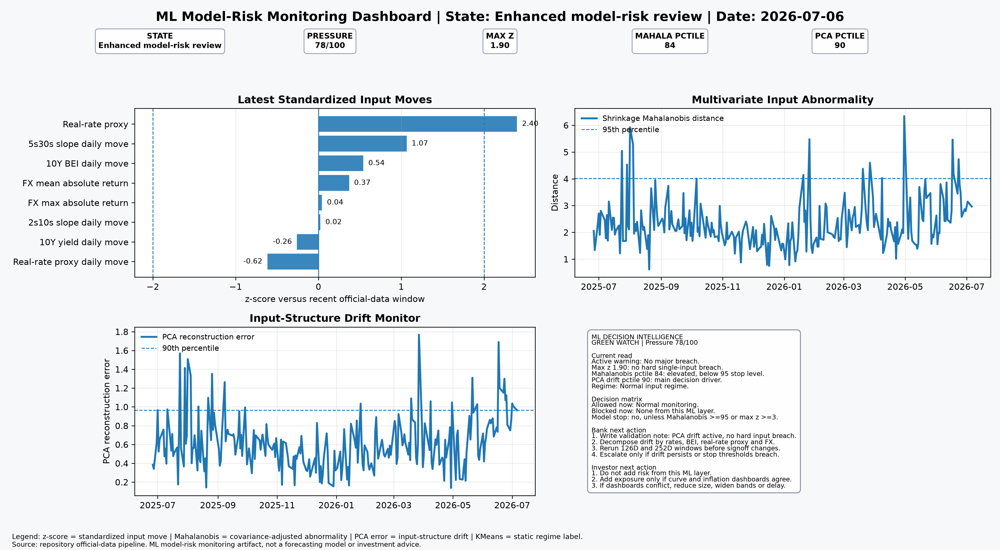

# ML Model-Risk Monitoring Report

## Decision state: Enhanced model-risk review

**Monitoring date:** 2026-07-06  
**ML pressure score:** 77.8 / 100  
**Decision flags:** no major ML monitoring threshold breach  
**Static regime:** Normal input regime

## Direct interpretation

This layer does not forecast markets. It creates a model-risk decision gate from official rates, FX and inflation inputs.

**Decision gate: AMBER REVIEW.**

The active warning is input-structure drift, not a hard single-variable shock. The latest maximum z-score is below the hard breach threshold, and the Mahalanobis percentile is elevated but below the stop-review level. PCA drift is the main issue because the recent factor structure is less stable than usual.

Decision consequence:

| Action | Decision |
|---|---|
| Use model output for monitoring | Allowed |
| New exposure signoff from this ML layer | Blocked |
| Automatic threshold recalibration | Blocked |
| Limit change | Blocked |
| Formal model stop | Not triggered |
| Escalation trigger | PCA drift persistence, Mahalanobis >= 95, or max z >= 3 |

## Latest signals

| Signal | Value |
|---|---:|
| Max absolute rolling z-score | 1.905 |
| Main z-score feature | real_rate_proxy |
| Mahalanobis distance | 2.963 |
| Mahalanobis percentile | 83.7 |
| PCA reconstruction error | 0.963 |
| PCA error percentile | 89.7 |
| Static regime | Normal input regime |

## Model-selection table

| Validation question | Primary tool | Challenger tool | Implemented in v0.7 | Rationale |
|---|---|---|---:|---|
| Is the current input move abnormal in one variable? | Rolling z-score | Rolling percentile rank | True | Useful for direct input-level breaches and easy validation audit trails. |
| Is the joint rates, FX and inflation state abnormal? | Shrinkage Mahalanobis distance | Robust covariance / Elliptic Envelope | True | Captures covariance-adjusted multivariate abnormality with stabilized covariance estimates. |
| Has the input factor structure drifted? | PCA reconstruction error | Kernel PCA | True | Detects whether current inputs are poorly explained by the recent factor structure. |
| Which static monitoring regime is active? | KMeans regime clustering | Gaussian Mixture Model | True | Provides a transparent static input-regime classification for monitoring reports. |
| Is there nonlinear anomaly behavior beyond distance metrics? | Isolation Forest | Local Outlier Factor | False | Planned challenger for nonlinear anomaly detection once dependency policy is expanded. |
| Is the system switching dynamically between latent regimes? | Gaussian Hidden Markov Model | Kalman/state-space model | False | Reserved for the dynamic regime layer after static monitoring is validated. |

## Bank implication

The bank decision is an Amber Review gate. Keep the model available for monitoring and reviewer context, but block new exposure signoff, automatic threshold recalibration and limit changes from this ML layer. The validation note should state: PCA drift is active, no hard single-input breach is present, and the joint input state is elevated but below the stop-review threshold. The next task is to decompose the drift into rates, BEI, real-rate proxy and FX drivers, then rerun the monitoring stack under 126D and 252D windows. Escalate only if PCA drift persists across refreshes, Mahalanobis distance crosses the 95th percentile, or the maximum z-score breaches 3.

## Investor implication

The investor decision is to avoid adding risk from this ML layer alone. The ML layer is warning that the input structure is unstable, not giving an exposure direction. Exposure can be increased only if the curve dashboard and the inflation-derivatives dashboard confirm the same direction. If those dashboards disagree, reduce sizing, widen risk bands or delay the trade.

## Validator challenge

Challenge whether the selected tool matches the validation question. A univariate breach should not be treated the same as covariance instability. PCA drift should not be treated as a trading signal. KMeans regime labels are static monitoring labels, not causal explanations. Isolation Forest and Gaussian HMM remain challenger roadmap tools until separately implemented and tested.

## Limitations

This v0.7 layer uses transparent dependency-light diagnostics: rolling z-scores, percentile ranks, shrinkage Mahalanobis distance, PCA reconstruction error and deterministic KMeans clustering. It does not yet implement Isolation Forest, Gaussian Mixture Models or Gaussian Hidden Markov Models.
