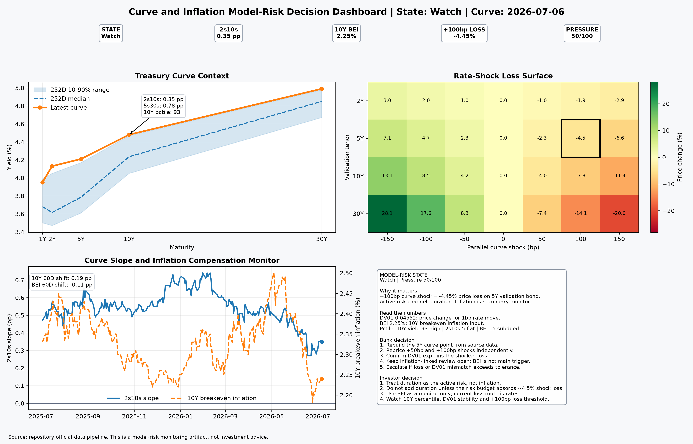

# One-Page Curve and Inflation Decision Report

## Decision state: Watch

**Curve date:** 2026-07-06  
**Inflation date:** 2026-07-07  
**Decision flags:** +100bp valuation loss above 4 percent  
**Validation pressure score:** 49.7 / 100

## Decision metrics

| Metric | Value |
|---|---:|
| 1Y Treasury | 3.950% |
| 2Y Treasury | 4.130% |
| 5Y Treasury | 4.210% |
| 10Y Treasury | 4.480% |
| 30Y Treasury | 4.990% |
| Curve level | 4.352% |
| 2s10s slope | 0.350 pp |
| 5s30s slope | 0.780 pp |
| 10Y breakeven inflation | 2.250% |
| 10Y yield 60D shift | 0.190 pp |
| Breakeven inflation 60D shift | -0.110 pp |
| 10Y yield percentile, 252D | 93.3 |
| 2s10s percentile, 252D | 4.8 |
| Breakeven percentile, 252D | 14.7 |
| Validation bond price | 99.8286 |
| DV01 | 0.045517 |
| +50bp valuation impact | -2.252% |
| +100bp valuation impact | -4.451% |

## Direct interpretation

- **Primary validation trigger:** +100bp valuation loss above 4 percent.
- **Curve channel:** valuation loss is driven by duration exposure to parallel curve shocks. The 2s10s and 5s30s slopes define the term-structure context that a validator must challenge.
- **Inflation channel:** 10Y breakeven inflation is the public inflation-compensation input. It anchors the next layer of inflation-linked valuation review.
- **Decision use:** this is not a market call. It is a reproducible evidence object for model validation, revalidation prioritization, sensitivity review and monitoring escalation.

## Bank implication

Treat this as a curve-validation watch item. Rebuild the 5Y curve point from source data, reprice the +50bp and +100bp shocks independently, and verify that DV01 explains the shocked valuation loss. Keep the inflation-linked review open, but current evidence points first to duration sensitivity, not inflation compensation.

## Investor implication

The investor decision is duration-first. A +100bp rate shock creates a material loss on the validation instrument, so adding duration requires enough risk budget to absorb that loss. BEI is subdued versus recent history, so inflation compensation should be monitored, but it is not the active loss driver in the current state. The next watch points are the 10Y yield percentile, DV01 stability and whether the +100bp shock loss remains above the review threshold.

## Validator challenge

Challenge the curve source, missing-data treatment, interpolation method, discounting convention, shock design, inflation proxy, sensitivity stability and whether the current input environment sits outside the model-development distribution.
